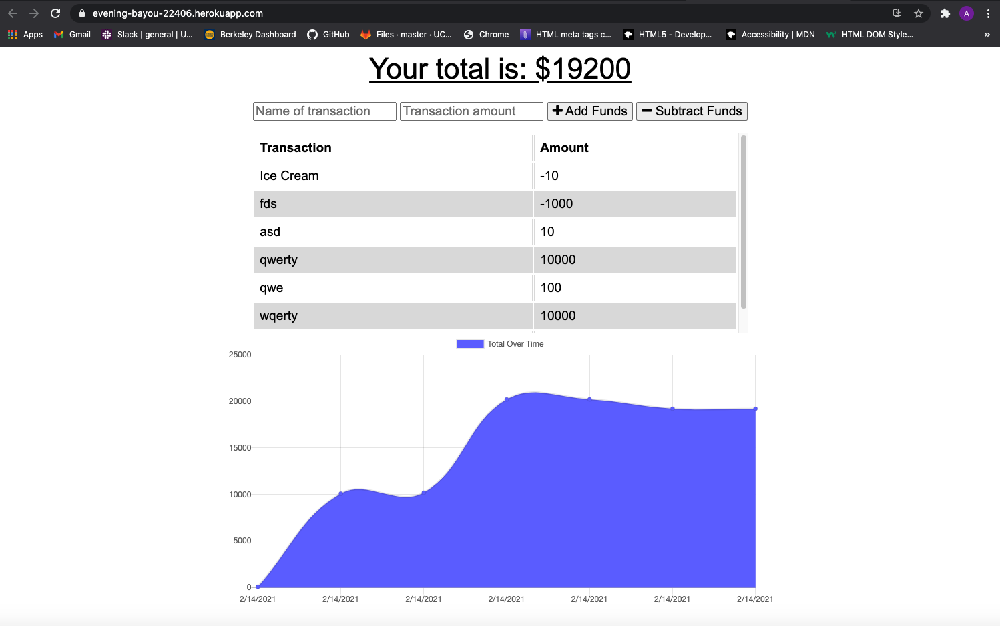
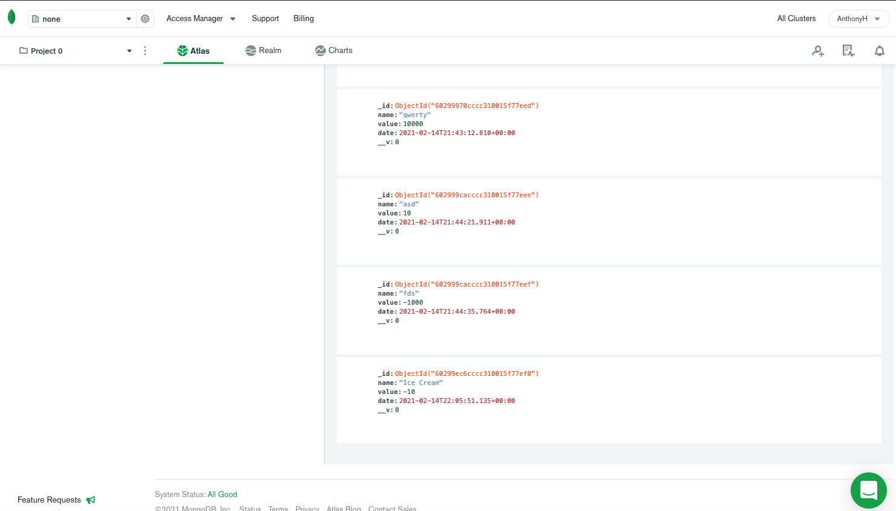

# Budget Tracker 

## Description
The purpose of this project is to add the functionality of the application being online while the application is offline.
When the application is offline, the user can continue to add and subtract funds from the budget tracker and the browser will
show the transaction being added, the total being adjusted to represent the new totals, and change in the chart caused by the transaction.

## Concept
The concept of the project is to provide options for bored individuals, similar to pulling out a box of activities in a cozy living room. Put your feet up, sit by the fireplace, and choose between reading a random book on the Gutenberg Project, test your trivia skills, or laugh at random jokes - all with just the click of a button.
While offline, the submitted transactions will be stored locally in indexedDB and once back online, the transactions will be saved to Mongo Atlas where the database is hosted.
The application assests will be cached using service-worker.js so that the functionality will persist while the application is offline.

## Features
The application has a total field, input fields to add a transaction, a historical list of the transactions that have occurred, and a chart to show the graphical changes to the total
as transactions are inputed.

### Viewing and Using
A live version of The Budget Tracker can be viewed here on [Budget Tracker](https://evening-bayou-22406.herokuapp.com/).
The project files can be viewed on github at the project repo [here](https://github.com/anthonykieu/budget-tracker).  
To test the offline feature, first open the inspect in Chrome Devtools. Next, go to the "Network" tab and change from online to offline.
Once offline, submit a transaction. The application should update the totals based on the submission while still offline. Go to the "Application" tab and go to the IndexedDB and you should see the transaction stored locally.
Go back to "Network" tab and you should see the transaction in red. Turn the netwoek back to online and you should see a code 200 saying the transaction is good. If you go back to the "Application" tab, the IndexedDB should be gone if you refresh the page.
The image below will show that Mongo Atlas database has updated with the transactions that were submitted offline and updated once back online.  

## Contributors
This project was created by the following developers.

* [Anthone Kieu](https://github.com/anthonykieu)

## Resources
* [Deployed Application](https://git.heroku.com/evening-bayou-22406.git)
* [Github Code Respository](https://github.com/anthonykieu/budget-tracker)
* [Express](https://expressjs.com/)
* [MongoDB](https://www.npmjs.com/package/mongodb)
* [Heroku](https://www.heroku.com)
* [MongoDB Atlas](https://www.mongodb.com/cloud/atlas/lp/try2?utm_source=google&utm_campaign=gs_americas_united_states_search_core_brand_atlas_desktop&utm_term=mongodb&utm_medium=cpc_paid_search&utm_ad=e&utm_ad_campaign_id=12212624338&gclid=CjwKCAiAsaOBBhA4EiwAo0_AnMmu4tcTgKxXiIxrZSFXPxleli6AeUWsLwRt4SZAbs8FuFZB4Ce77RoCyB8QAvD_BwE)
* [Mongoose](https://www.npmjs.com/package/mongoose)
* [NPM-Morgan](https://coralogix.com/log-analytics-blog/morgan-npm-logger-the-complete-guide/)
